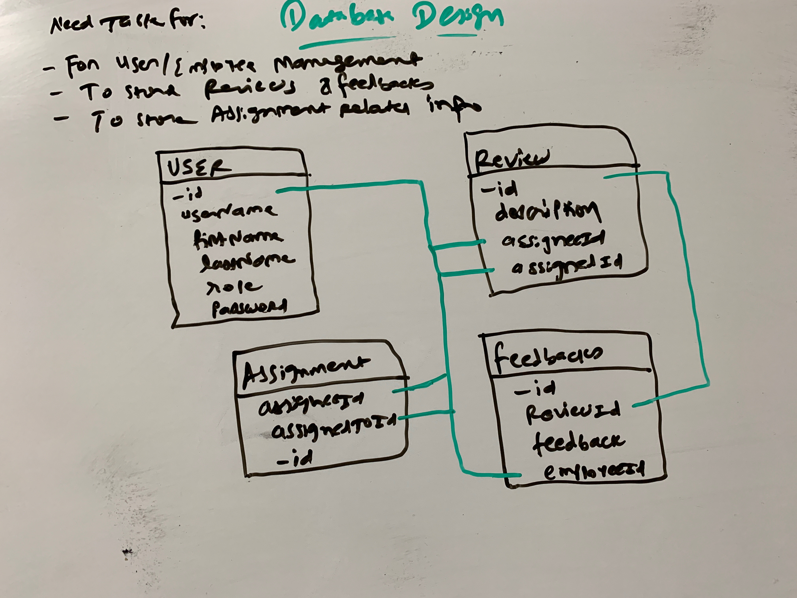

## My way of thinking

- First thing which everyone does is to "understand" requirements carefully!
- As in this challenge, the requirement is very brief and vague, I need to imagine in some way that how the system would look like.
- Probably best is start thinking from user perspective, ask question myself, what they need ? why they need ? how they need ? etc
- I spend time in thinking process rather than start coding instantly. I make wireframes in whiteboard. At fist that's totally rough design, may be "bad" design ? But that's ok for me. I continue my thining process and make iterative improvements.
- I think about screens, pages, user actions, user flows, data flows and all those UI related things.
- After finishing possible good UI design, I start thinking about what will I need from backend ? There API design starts.
- Similarly at first it cannot be best design but step by step it gets improved.
- Think about nouns, verbs, and give API endpoints good and meaningful name.
  - Like *To get all users* `/users/` is straightforward to understand that it will give all users.
- After that think about **Data**. May that's most challenging. Because later in app, small database change affects a lot!
- I make data dictionary like tables in whiteboard too and try to relate them.

*(when I was thinking about data design)*